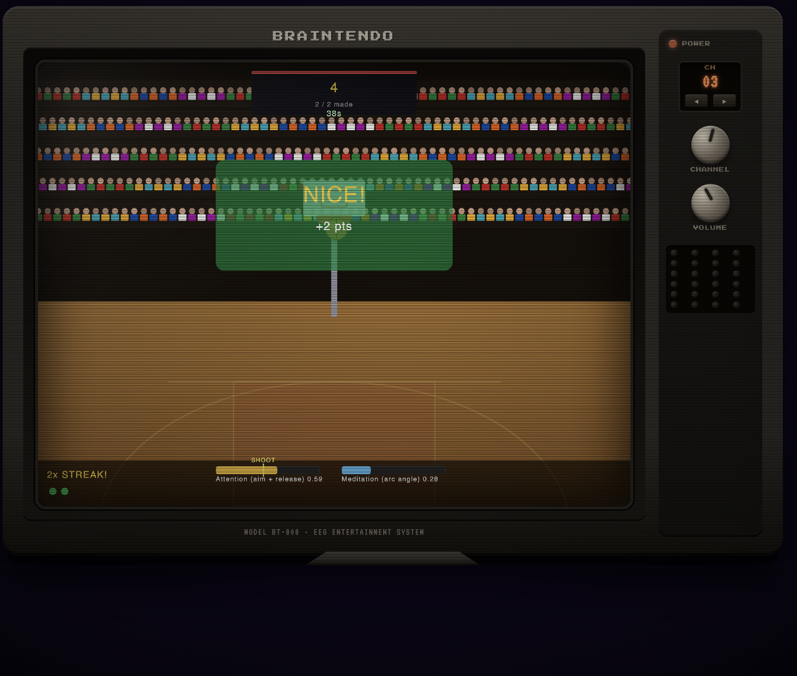

# Brain Games — Cartridge Deck

🚀 **[Live Demo](https://kylemath.github.io/BrainGames)** 🚀




A standalone, zero-build webapp that hosts thirteen brain-controlled games
inside a simulated 1990s console — CRT tube, cartridge-deck picker, chunky
plastic TV set, physical knob that actually changes channels. Works with
either a **Muse EEG headset** (Web Bluetooth) or the **built-in
simulator** (no hardware needed).

Drop `python3 -m http.server 8000` into the folder and open the browser.
That is the build.

---

## Table of contents

- [What's in the box](#whats-in-the-box)
- [Run locally](#run-locally)
- [Controls](#controls)
- [How a play session flows](#how-a-play-session-flows)
- [Add your own game](#add-your-own-game)
- [Folder layout](#folder-layout)
- [EEG API for game authors](#eeg-api-for-game-authors)
- [Shared helpers (`BGShared`)](#shared-helpers-bgshared)
- [Manifest format](#manifest-format)
- [Session persistence](#session-persistence)
- [TV-set display contract](#tv-set-display-contract)
- [Project history](#project-history)
- [Credits and trademarks](#credits-and-trademarks)

---

## What's in the box

**Picker page (`index.html`) — the cartridge deck.**

A full-screen 90s Nintendo-style cartridge selector. Three connection
lights across the top (KEYBOARD / MOUSE / BRAIN) gate access to the deck.
Once all three are green, thirteen cartridges reveal themselves with live
animated pixel previews driven by a shared RAF loop. Clicking `PLAY` on
any cartridge takes you to the game runner.

**Runner page (`play.html`) — the TV.**

Every game renders inside a simulated CRT TV set (brand plate, speaker
grille, chromed knobs, power LED, channel readout, trapezoid stand). The
CHANNEL knob is clickable — rotate through cartridges without leaving the
TV screen. Left-click = next, right-click = previous. Arrow buttons under
the channel readout and `[` / `]` keyboard shortcuts do the same thing.

**Fourteen games across four categories:**

| Category    | Games                                                              |
|-------------|---------------------------------------------------------------------|
| Sports      | Golf Driving Range · Archery Range · Basketball · Soccer Shoot-out |
| Calm        | Rowing · Balance Beam · Balloon Pop · Deep Sea Diver               |
| Focus       | Maze Navigator · Reaction Race                                     |
| Brain Games | Snake Feast · Zen Breakout · Brainvaders · EEG FPS Range           |

The four **Brain Games** titles are original arcade-classic rethinks
built specifically for this package — a Snake variant driven by alpha
waves (with food, growing body, self-collision, score), Breakout with
meditation-controlled paddle width, a Space-Invaders-style wave
shooter where beta sets cannon cooldown and meditation powers a
shield, and a pseudo-3D first-person target range (a port of
[Joe Gannon's Unity + BlueMuse "EEG FPS"](https://github.com/j-gannon/EEG-FPS-Game))
where attention tightens the crosshair, meditation steadies the aim,
beta sets fire-rate, and gamma triggers a 3-shot burst.

**Zero editor chrome.** No Monaco, no AI assistant, no docs panel, no code
saves — the picker and runner are the entire interface.

## Run locally

```bash
cd /path/to/BrainGames
python3 -m http.server 8000
```

Then open <http://localhost:8000/>. Any other static file server works
(`npx serve`, `caddy file-server`, nginx, Netlify drop, etc.) — no build
step, no Node, no npm.

## Controls

- **Move the mouse** and **press any key** — the KEYBOARD and MOUSE
  lights on the picker go green.
- **Click `USE SIMULATOR`** — generates plausible EEG (alpha / beta /
  theta / delta / gamma + derived attention + meditation) at 20 Hz. The
  BRAIN light goes green.
- **Click `CONNECT MUSE`** — opens the Web Bluetooth device picker.
  Works in Chrome / Edge / Opera on desktop. Muse 2016 / Muse 2 / Muse S
  are all supported. The BRAIN light goes green once data flows.
- All three lights on ⇒ the cartridge grid unlocks.

Inside a running game, each title shows its own control hints on the
intro panel (arrow keys, `SPACE`, mouse, etc.).

**TV remote controls (on `play.html`):**

| Control                           | Action            |
|-----------------------------------|-------------------|
| Left-click the **CHANNEL** knob   | Next cartridge    |
| Right-click the **CHANNEL** knob  | Previous cartridge|
| ◀ / ▶ buttons under the channel readout | Previous / Next |
| `]` (right bracket)               | Next cartridge    |
| `[` (left bracket)                | Previous cartridge|
| `◀ BACK TO DECK` link (top left)  | Return to picker  |

## How a play session flows

```
┌──────────────┐   move mouse,    ┌──────────────┐   click cart     ┌──────────────┐
│  index.html  │ ────tap key───▶  │  deck fully  │ ────PLAY───────▶ │  play.html   │
│ cartridge    │    click SIM     │  unlocked    │                  │  ?game=<id>  │
│ deck + gate  │                  │  13 cards    │                  │  TV set      │
└──────────────┘                  └──────────────┘                  └──────┬───────┘
                                                                            │
                                                                            │ CHANNEL knob
                                                                            │ / ] / [
                                                                            ▼
                                                                   ┌──────────────┐
                                                                   │  play.html   │
                                                                   │  ?game=<next>│
                                                                   │  (no re-gate)│
                                                                   └──────────────┘
```

Session state (simulator on/off, keyboard seen, mouse seen) is stored in
`sessionStorage`, so channel-changes and back-to-deck navigation don't
force you to re-connect every time.

## Add your own game

1. **Drop a file** at `games/<yourGame>.js` with a JSDoc header so the
   manifest builder can discover it:

   ```javascript
   /**
    * @id yourGame
    * @title Your Game
    * @category Brain Games
    * @order 60
    * @newGame true
    *
    * EEG mappings:
    *   attention  -> one-line description of what attention does here
    *   meditation -> ...
    */

   function setup() {
     // canvas is created for you at the TV-tube size (800x600).
     // If you call createCanvas(...), its dimensions are ignored and
     // replaced with 800x600 so your layout matches the TV.
     colorMode(RGB);
   }

   function draw() {
     background(20, 14, 8);
     const eeg = window.BGShared.readEEG();
     // … your game code …
   }
   ```

2. **Regenerate the manifest** (stdlib-only Python):

   ```bash
   python3 tools/build_manifest.py
   ```

3. **Reload** `index.html`. The new cartridge shows up. If you defined a
   hand-authored preview animation in `core/pickerBoot.js`'s
   `previewDraws[<id>]`, it will play on the card; otherwise a generic
   fallback animation is used.

No build, no bundler, no registry edit, no HTML change.

## Folder layout

```
BrainGames/
├── index.html             — Cartridge-deck picker (90s chrome)
├── play.html              — Runner page with TV set
├── README.md              — This file
├── catalogue.json         — Category ordering + per-category blurbs
├── .gitignore
├── core/
│   ├── eegData.js         — window.eegData global (alpha/beta/…/raw history)
│   ├── eegSimulator.js    — 20 Hz synthetic EEG, DOM-decoupled
│   ├── museManager.js     — Web Bluetooth bridge, DOM-decoupled
│   ├── gameRunner.js      — Loads a game, forces 800x600 tube size
│   ├── pickerBoot.js      — Picker state machine + manifest fetch + previews
│   ├── playBoot.js        — TV wiring: gate modal + channel knob + readouts
│   ├── sessionState.js    — sessionStorage helper for persistence
│   └── __smoke.html       — Standalone EEG-core smoke page
├── shared/                — window.BGShared helpers (21 exports)
│   ├── styling90s.js      — palette + pixel-border + scanline drawing
│   ├── eegSmoothing.js    — makeSmoother / makeGraceBuffer / readEEG
│   ├── hud.js             — drawBar / drawStatBox / drawResultOverlay
│   ├── intro.js           — drawIntroPanel / drawSummaryPanel
│   └── crowd.js           — stadium / crowd / scoreboard
├── games/                 — One .js per game + manifest.json
│   ├── manifest.json      — Generated by tools/build_manifest.py
│   ├── snakeFeast.js      — New: classic snake + food + alpha-assist
│   ├── ZenBreakout.js     — New: breakout with meditation-width paddle
│   ├── Brainvaders.js     — New: wave shooter with shield + spread-shot
│   ├── eegFPS.js          — New: pseudo-3D FPS port of j-gannon/EEG-FPS-Game
│   └── … 10 classic EEG games …
├── styles/
│   └── main.css           — Palette, picker chrome, TV set, CRT overlay
├── tools/
│   └── build_manifest.py  — Scanner that regenerates games/manifest.json
├── vendor/
│   └── muse-browser.js    — muse-js Web Bluetooth bundle
└── muse-browser.js        — Duplicate kept for backward compatibility
```

## EEG API for game authors

`window.eegData` is populated before any game's `setup()` runs, regardless
of whether the source is Muse or the simulator:

```js
eegData.alpha       // 0..1
eegData.beta        // 0..1
eegData.theta       // 0..1
eegData.delta       // 0..1
eegData.gamma       // 0..1
eegData.attention   // 0..1 — derived from (beta + gamma) / 2
eegData.meditation  // 0..1 — derived from (alpha + theta) / 2
eegData.connected   // bool
```

Raw electrode history (for time-series visualizations):

```js
eegData.getRawChannel('TP9', 256)   // latest N samples from TP9
eegData.getAllChannels(256)         // { TP9, AF7, AF8, TP10 }
eegData.getRecentEpoch(128)         // transposed [t][channel] epoch
```

For never-throw access with graceful defaults:

```js
const eeg = window.BGShared.readEEG();
// Always returns { alpha, beta, theta, delta, gamma,
//                  attention, meditation, connected } with fallbacks.
```

## Shared helpers (`BGShared`)

| Group       | Exports                                                                                 |
|-------------|------------------------------------------------------------------------------------------|
| Smoothing   | `makeSmoother(n)`, `makeGraceBuffer({window, threshold})`, `readEEG({defaults})`         |
| Styling     | `PALETTE`, `toColor`, `drawPixelBorder`, `drawScanlineOverlay`, `drawChromeText`, `blinker`, `fillVerticalGradient`, `drawCrtPanel` |
| HUD         | `drawBar`, `drawStatBox`, `drawResultOverlay`, `drawTopHud`                             |
| Panels      | `drawIntroPanel`, `drawSummaryPanel`                                                     |
| Scenery     | `drawStadiumBackground({mode: 'court' / 'field' / 'green' / 'range'})`, `drawCrowd`, `makeCrowd`, `drawScoreboard` |

## Manifest format

`games/manifest.json` is a flat array, sorted by `(category, order,
filename)`, regenerated by `tools/build_manifest.py`:

```json
[
  {
    "id": "snakeFeast",
    "title": "Snake Feast",
    "category": "Brain Games",
    "order": 30,
    "file": "games/snakeFeast.js",
    "newGame": true,
    "mappingOneLiner": "alpha -> assistive auto-steer toward nearest pellet"
  }
]
```

The picker's card order, the TV-channel numbering, and `[`/`]` cycling
all walk this array in order.

## Session persistence

`core/sessionState.js` wraps `sessionStorage` with three keys:

| Key                   | Meaning                                                |
|-----------------------|--------------------------------------------------------|
| `bg.simulatorActive`  | Auto-start the simulator on the next page load.       |
| `bg.keyboardSeen`     | Light the KEYBOARD gate immediately on load.          |
| `bg.mouseSeen`        | Light the MOUSE gate immediately on load.             |

Scope is the **browser tab** (sessionStorage). State survives
picker ↔ runner navigation and channel-knob hops, but closing the tab
clears it. Muse connections are **not** persisted — Web Bluetooth
requires a fresh user-gesture on every page load, so auto-restore would
just fail silently.

## TV-set display contract

The runner forces every sketch onto a fixed **800 × 600 CRT tube**,
regardless of what it passes to `createCanvas`. The same holds for
`windowWidth` / `windowHeight` — games that read them for layout math
see the tube dimensions. This guarantees every game renders at the
resolution its author designed for, independent of the actual browser
viewport; the surrounding TV shell (bezel, knobs, stand) is CSS-scaled
down on smaller screens via `@media` breakpoints, but the backing canvas
stays pixel-exact.

The tube size is defined in one place — `TUBE_WIDTH = 800`,
`TUBE_HEIGHT = 600` at the top of `core/gameRunner.js`. Change it there
and the CSS tube container (`--tube-w` / `--tube-h` at the top of
`styles/main.css`) and everything stays in sync.

## Project history

This package was extracted from the larger
[Brainimation](https://github.com/kylemath/Brainimation) research project
as a self-contained cartridge-deck launcher. Every file in `games/` was
originally authored inside that project; this package adds the
cartridge-deck picker, the TV-set runner, the shared helpers, and three
new arcade-classic brain-game titles (Snake Feast, Zen Breakout,
Brainvaders).

The sub-package was built by a multi-agent team following a
Coordinator → Managers → Sub-subagents delegation pattern, with detailed
execution reports preserved in the parent project's
`backgroundMaterial/agent1811/` folder.

## Credits and trademarks

Built on [p5.js 1.7.0](https://p5js.org/) and
[muse-js](https://github.com/urish/muse-js). Fonts are
[Press Start 2P](https://fonts.google.com/specimen/Press+Start+2P) and
[VT323](https://fonts.google.com/specimen/VT323) from Google Fonts.

This project is not affiliated with any console manufacturer. "Nintendo",
"Muse", and any other names referenced by the visual styling are
trademarks of their respective owners. The word **BRAINTENDO** stamped
on the TV faceplate is a parody homage.
